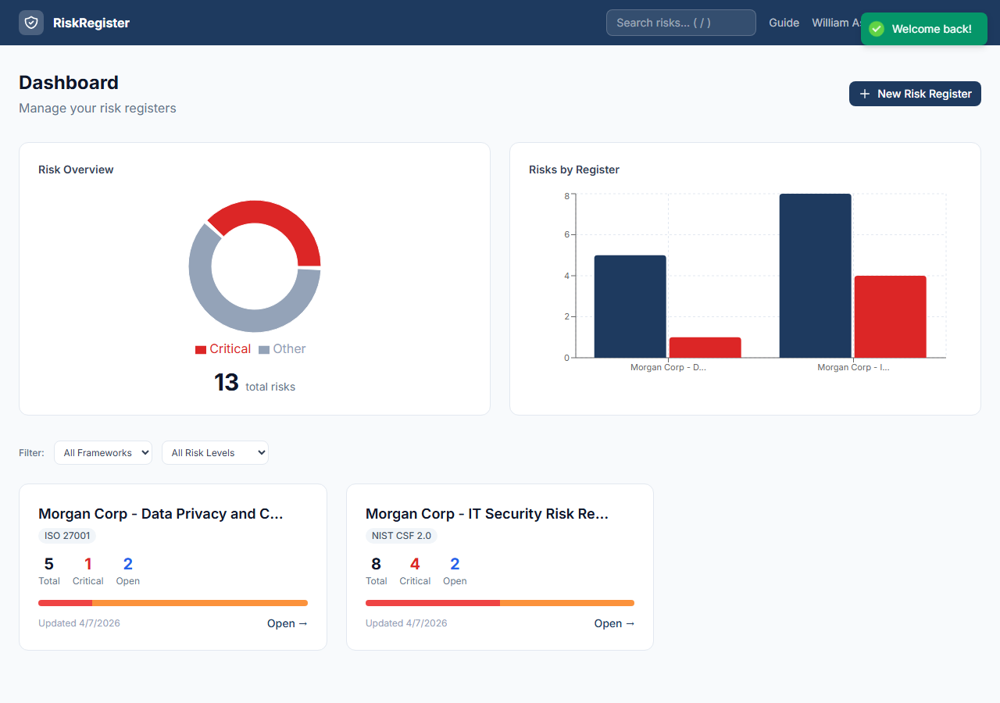
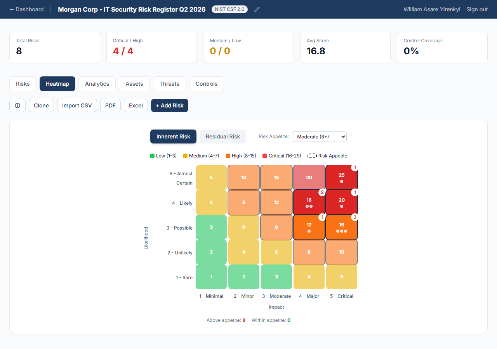

# Risk Register Builder

A professional, full-stack web application for creating, managing, and visualizing risk registers. Built for IT auditors, CISOs, GRC analysts, and compliance professionals who need a modern alternative to Excel-based risk registers.

**Live Demo:** [risk-register-builder.onrender.com](https://risk-register-builder.onrender.com)

## Features

- **Guided Risk Wizard** - Step-by-step workflow: identify assets, threats, controls, then assess risks with clickable rating grids
- **Interactive Heat Map** - 5x5 risk matrix with toggle between inherent and residual views, tooltips, and click-to-filter
- **Framework Templates** - Pre-populated data for NIST CSF 2.0, ISO 27001, and SOX ITGC
- **PDF Export** - Professional multi-page reports with cover page, executive summary, heat map visualization, risk details, and appendices
- **Excel Export** - Multi-sheet workbook with conditional formatting, frozen headers, and color-coded risk scores
- **Risk Assessment** - Auto-calculated inherent and residual risk scores with visual before/after comparison
- **Dashboard** - Overview of all registers with summary stats, risk distribution bars, and quick actions
- **Full CRUD** - Create, read, update, and delete risks, assets, threats, and controls with inline editing
- **Mobile Responsive** - Fully responsive design with bottom-sheet modals, hamburger menus, and touch-friendly controls
- **Collaboration** - Share registers with team members as editors or viewers
- **Audit Trail** - Full risk change history with timestamps and user attribution

## Tech Stack

| Layer | Technology |
|-------|-----------|
| Frontend | React 18 + Vite |
| Styling | Tailwind CSS |
| Backend | Node.js + Express |
| Database | PostgreSQL |
| PDF Export | jsPDF + jsPDF-AutoTable |
| Excel Export | ExcelJS |
| Auth | Express sessions + bcrypt |
| Deployment | Render |

## Demo Accounts

| Email | Password | Role |
|-------|----------|------|
| sarah.chen@meridian.io | demo1234 | CISO - owns NIST CSF & ISO 27001 registers |
| james.okafor@meridian.io | analyst1 | Vulnerability Mgmt - editor on NIST CSF |
| priya.sharma@meridian.io | manager1 | GRC Manager - owns SOX ITGC register |

## API Endpoints

### Authentication
| Method | Endpoint | Description |
|--------|----------|-------------|
| POST | `/api/auth/register` | Create new account |
| POST | `/api/auth/login` | Login |
| POST | `/api/auth/logout` | Logout |
| GET | `/api/auth/me` | Get current user |

### Registers
| Method | Endpoint | Description |
|--------|----------|-------------|
| GET | `/api/registers` | List all registers |
| POST | `/api/registers` | Create register |
| GET | `/api/registers/:id` | Get register with all data |
| PUT | `/api/registers/:id` | Update register |
| DELETE | `/api/registers/:id` | Delete register |

### CRUD Resources (Assets, Threats, Controls, Risks)
| Method | Endpoint | Description |
|--------|----------|-------------|
| GET | `/api/registers/:id/{resource}` | List items |
| POST | `/api/registers/:id/{resource}` | Create item |
| PUT | `/api/registers/:id/{resource}/:itemId` | Update item |
| DELETE | `/api/registers/:id/{resource}/:itemId` | Delete item |

### Exports
| Method | Endpoint | Description |
|--------|----------|-------------|
| GET | `/api/registers/:id/export/pdf` | Download PDF report |
| GET | `/api/registers/:id/export/excel` | Download Excel workbook |

## License

MIT License

---

Built by **Rose Achar** ([LinkedIn](http://www.linkedin.com/in/rose-achar)) & **William Asare Yirenkyi** ([LinkedIn](https://www.linkedin.com/in/william-asare-yirenkyi/))
